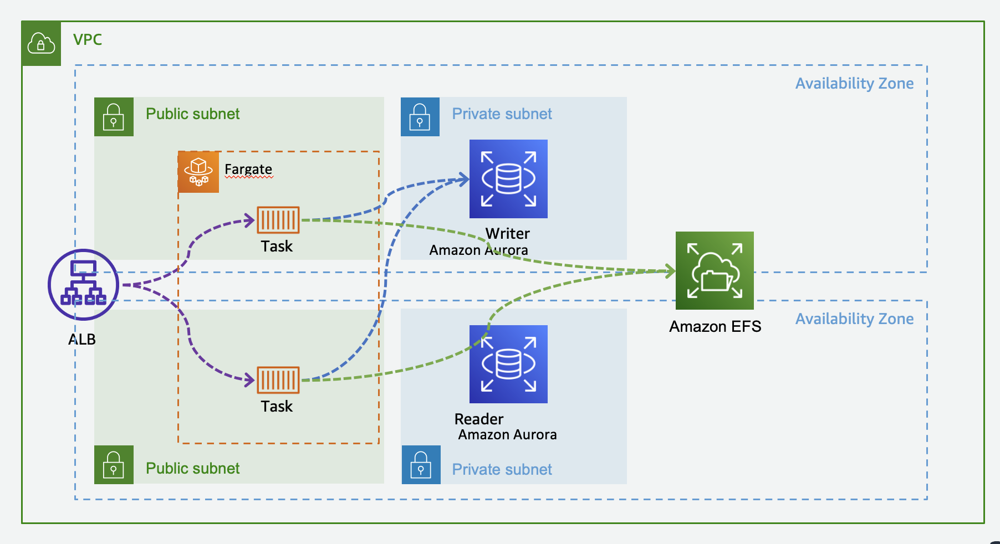

# ECS/Fargateデモサイト+EFSマウントサンプル

※こちらはあくまでサンプルコードとなります。お客様ご自身で検証を行った上でご利用ください。  

このディレクトリは以下を含みます。

- ECS x Fargate の WordPress サイトをデプロイするスタックを定義するAWS CDKのコード
- EFSファイルシステムの作成とFargateタスクからマウントするAWS CDKのコード
- ECS Execを有効化するためのAWS CDKのコード




## ディレクトリ構成

以下は重要なファイル·ディレクトリのみ記載しています。

```shell
.
├── README.md                       # 本READMEファイル
├── bin                             # スタックの定義
├── cdk.json                        # CDKの設定ファイル
├── jest.config.js                  # JavaScriptのフレームワークJestの設定ファイル
├── lib                             # CDK(Stack)の実装
│   ├── dummy-stack.ts              # サンプルのWordPressサイトとEFSをデプロイするStackの実装
├── package-lock.json               # ライブラリ依存関係の定義ファイル
├── package.json                    # ライブラリ依存関係の定義ファイル
├── test                            # CDKのテストコード(未使用)
└── tsconfig.json                   # TypeScriptの設定ファイル
```

## デプロイ方法

上記のリソースをAWSにデプロイする方法をまとめます。

### 準備・デプロイ

デプロイを実行する端末には、下記のソフトウェアが必要です。

- AWS CLI v2
- Node.js 14以上

なお、以下全て、シェルコマンドの初期カレントディレクトリはこの README.md が配置されたディレクトリと仮定します。

```shell
# IaCの依存関係をインストール
npm ci

# CDKをap-northeast-1リージョンで使えるように初期化する
AWS_REGION=ap-northeast-1 npx cdk bootstrap

# CDKで定義したリソースのデプロイ
npx cdk deploy --require-approval never

```

一連プロセスは15分ほどで終了します。ALBのDNSが出力されるため、メモしておいてください。
メモしたURLをブラウザで開きます。

WordPressの設定をするため、以下の操作を行います。

- 言語の選択画面で「日本語」を選択します。
- WordPressの設定画面で以下の項目に適当な値を入力します。
  - サイトのタイトル: サンプルサイト
  - ユーザー名: 任意のユーザー名(ex. "admin")
  - パスワード: 任意のパスワード
  - メールアドレス: 任意のメールアドレス
  - 検索エンジンでの表示にはチェックを入れます。
- 「WordPressをインストール」をクリックします
- 「ログイン」をクリックします
- 「サンプルサイトへ移動」をクリックします

## スケーリングポリシー

- ターゲット追跡スケーリングポリシー（ALBRequestCountPerTarget）
  - https://docs.aws.amazon.com/ja_jp/AmazonECS/latest/developerguide/service-autoscaling-targettracking.html
- ターゲットあたりのリクエスト数が100
- Maxのタスク数は20
